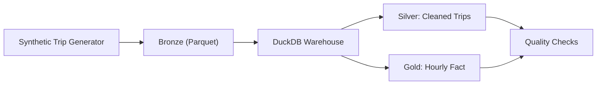
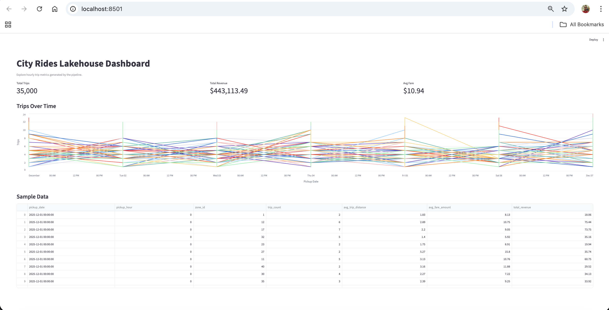

# City Rides Lakehouse

[](https://github.com/Vishnu567456/city-rides-lakehouse/actions/workflows/ci.yml)

A portfolio-grade, end-to-end data engineering project that simulates a ride-hailing platform and builds a lakehouse-style pipeline from raw events to analytics-ready marts. It showcases ingestion, data modeling, quality checks, and orchestration with clear documentation and reproducible runs.

**Why it stands out**
- Realistic schema and business metrics
- Partitioned raw data and incremental-friendly transforms
- Automated quality checks with clear pass/fail thresholds
- Clear architecture, reproducible CLI, and test coverage

## Architecture


## Quickstart
```bash
python -m venv .venv
source .venv/bin/activate
pip install -r requirements.txt

python -m src.pipeline.run_pipeline \
  --start-date 2025-12-01 \
  --days 7 \
  --rows-per-day 5000
```

## Outputs
- Raw: `data/bronze/trips/`
- Warehouse: `data/warehouse.duckdb`
- Quality report: `data/quality_report.json`

## Dashboard
Run the Streamlit app to explore hourly metrics:
```bash
streamlit run app.py
```
Note: run the pipeline first so `data/warehouse.duckdb` exists.
For cloud deployment steps, see `docs/deploy_streamlit.md`.

## Screenshots
Add a screenshot after running the dashboard:
- Save as `docs/dashboard.png`
- Embed it below



## Results (Sample Queries)
Run these in DuckDB to validate outputs:
```sql
SELECT COUNT(*) AS trips FROM silver_trips;
SELECT COUNT(*) AS hourly_rows FROM fct_trip_hourly;
SELECT * FROM fct_trip_hourly ORDER BY pickup_date, pickup_hour LIMIT 10;
```
Expected columns in `fct_trip_hourly`:
- `pickup_date`
- `pickup_hour`
- `zone_id`
- `trip_count`
- `avg_trip_distance`
- `avg_fare_amount`
- `total_revenue`

## dbt (Optional)
Use dbt to build models on top of the DuckDB warehouse.
```bash
cp dbt/profiles.yml.example ~/.dbt/profiles.yml
cd dbt
dbt debug
dbt build
```

## Models
- `silver_trips`
- `dim_zones`
- `fct_trip_hourly`

## Data Quality
Checks are executed after transformations and include:
- No null pickup or dropoff timestamps
- Positive distances and fares
- Reasonable passenger counts

## Tests
```bash
pytest -q
```

## Project Structure
- `src/pipeline/` Core pipeline code
- `docs/architecture.md` System overview
- `tests/` Data quality and transform tests
 - `dbt/` dbt project (optional)
 - `app.py` Streamlit dashboard

## Next Steps
- Swap DuckDB for a cloud warehouse target
- Plug in a real streaming source
